# OpenSpace Engineering

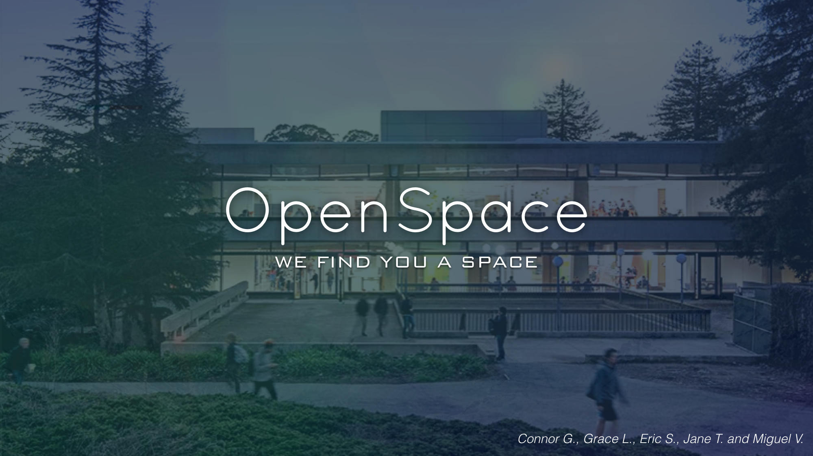

[For Tett](#the-tangled-web-of-web-apis)

## Welcome to our GitHub!

We are a location services company passionate about time and space. That is, our focus is saving you time, energy, and other resources by finding you a space.

Finding a space––to sit, work, study, play, eat––is not something we often worry about––until we have to.

We are in the business of making sure you never have to.

## The Problem

UC Berkeley serves 30k undergrads, 11k grads, as well as the broader Berkeley and Academic community. It is difficult to manage resources efficiently; it is also difficult to find a place to study sometimes.

After thinking about this problem more deeply our team agreed that finding a space––any space––that is open and ready to be occupied is actually a bit of a chore. Our team became very enthusiastic about this problem and its solution.

## The Solution

>We put real-time data into the hands of staff and students so that they can make real-time decisions.

Walking to a library––or any other facility––that is full, is drain on one's energy and time. Students are short on these two resources to begin with.

### Technical Solution

**Goal**: Serve our customers real-time data.

In order to realize a solution to this problem we sought to distill our problem down to its simplest components:

* **Our Customers** - students, staff, and the university

* **Spaces** - campus facilities, neighboring establishments
  
* **The Decision** - does a given space fullfil _the_ need

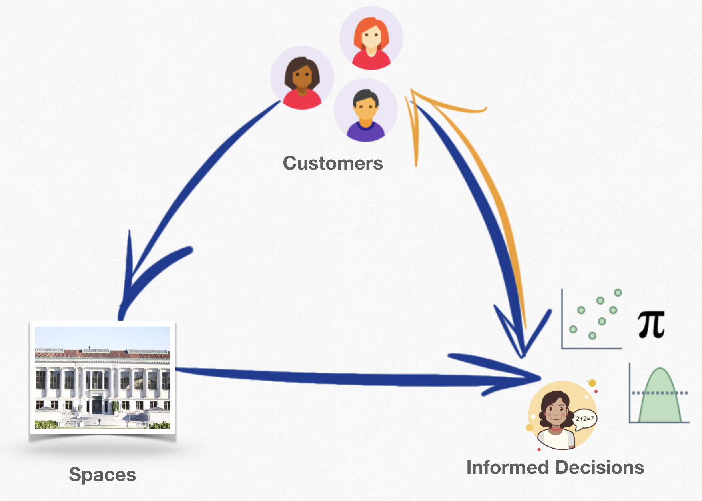

1. A user wants to find a space
2. Using our app they can see what is more or less available and what suits their needs
3. Using sensor data from nearby places and neat APIs we empower our
   users.
4. Users can then make a better-informed decision––where (and when) to go.

### Architecture and Tools

We have experimented with different technologies; our prototype consisted of a bare-bones **Node.js** web application serving mobile-style views.

<div align="center">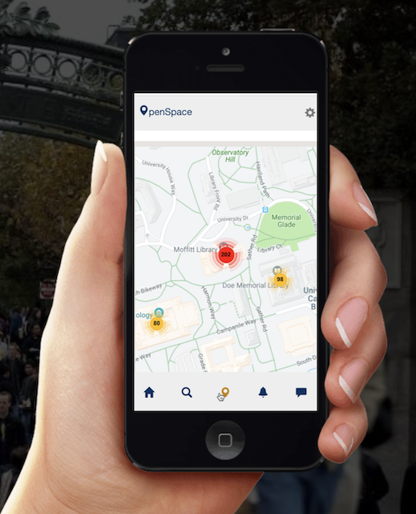</div>

However, we wanted to make our solution easy and fun to use so we kept searching for better architecture and better tools. We eventually chose to build a real-time mobile application with [Reat-Native](https://facebook.github.io/react-native/). React-Native allows us to write one application that we can cross compile to iOS and Android platforms.

We are combining the power of **Google APIs** + **Firebase** + the rich ecosystem surrounding **React-Native** to give our users general occupancy **statistics** of their first-choice space _and_ suggest nearby **alternatives**.

#### Mechanics

The mechanics of our application follow from our goals:

1. **GET** data from APIs, sensor data, and other data sources
2. Use **Google Maps, GeoEncoding, and Places APIs** to recommend nearby open spaces
3. Display this dynamic real-time content
   
#### Nuts and Bolts

In order to serve real-time content we need an API endpoint. In our particular use-case we will have to create an API to serve our app data from **UCB library sensors**. Once that is finished we can make a ```fetch``` call to our API and use the return values to **populate** the **occupancy** values on openspaceweb.org.

##### Obstacles

I wanted to completely rewrite our application from our old [mock up](https://ericdeansanchez.github.io/OpenSpaceMock/) into a nice and shiny mobile application. However, things didn't go exactly as planned due to scheduling mixups. Bummer.

So, I began writing a [React app](https://github.com/ericdeansanchez/OpenSpaceWeb) (vanilla react web app) to deploy/launch it same day. However, due to some unknown-unknowns becoming known, **decisions were made**.

In order to demonstrate [our solution](www.openspaceweb.org), I wrote some javascript and html––as calling ```fetch``` from a react app is not the same as ```fetch```ing **natively**.

I ```fetch``` some data from [Google Places API](https://developers.google.com/places/web-service/intro) and display it in the browser. **Easy**. Serving an API to myself, from myself, eh... Also **easy**. Just time consuming. So that is still in progress.


Writing apps is difficult. Launching a successful startup while writing an app is difficult, but necessary. These things are especially difficut when quality is a concern.

#### Iterations

[OpenSpace Mock Up](https://ericdeansanchez.github.io/OpenSpaceMock/)
[OpenSpace Web App Code](https://github.com/ericdeansanchez/OpenSpaceWeb)

Check out our web API **@** www.openspaceweb.org

#### Mobile App Progress

We have secured our applications authentication setup using **OAuth2.0** via ```react-native-google-signin``` and ```react-native-firebase```.

<div align="center">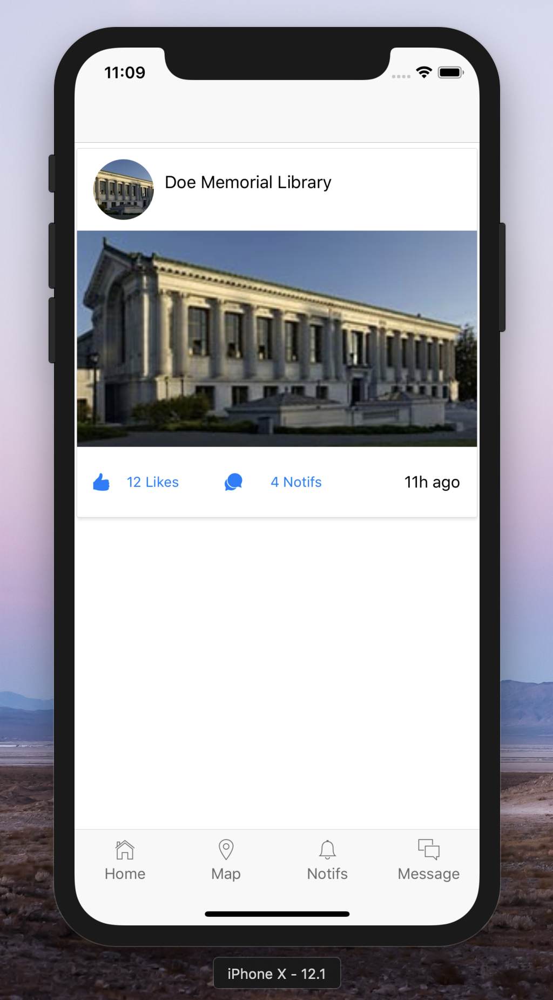</div>

#### Data Explorations

[OpenSpace Data](https://github.com/ericdeansanchez/OpenSpaceData)

#### The OpenSpace Team


##### The Tangled Web of Web APIs

Here we place markers on the map by making a ```fetch``` call to **Google Places API**.
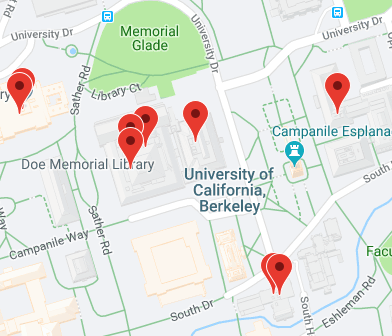

The work we are trying to do is to add an endpoint that serves our volume data via library sensor (which we don't have access to, yet).
Here we have the libraries that show ```open_now = false``` to ```occupany: 0```.
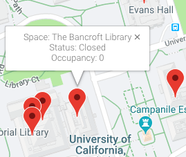

##### How We Got Here

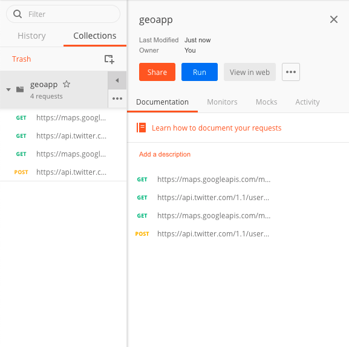
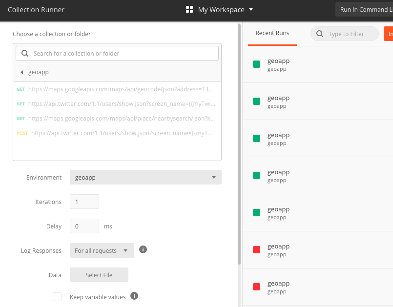
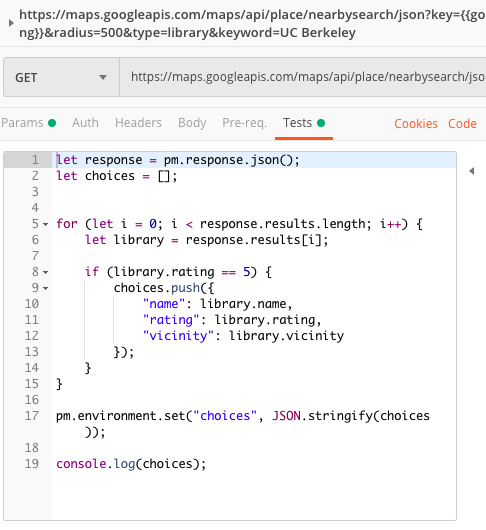

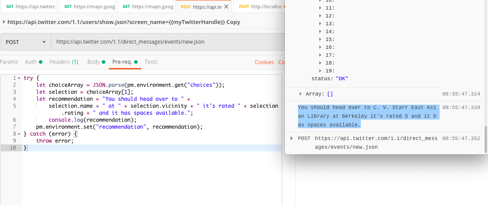
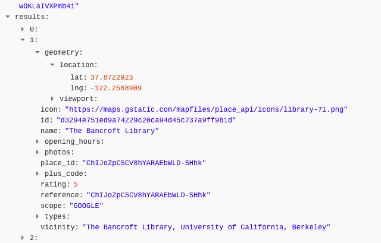
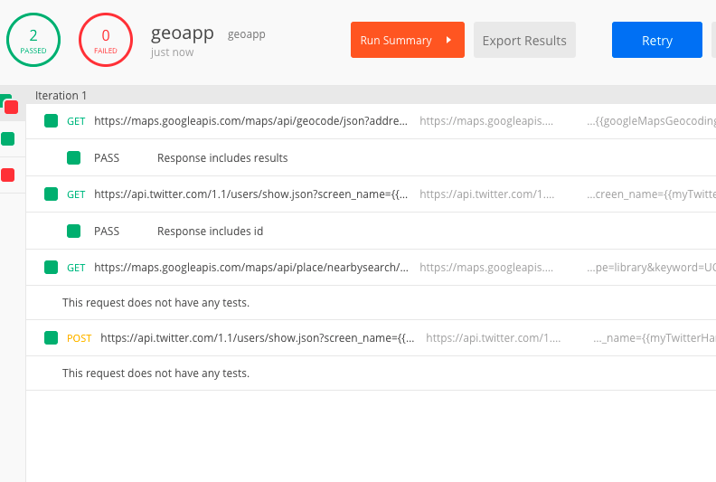


#### Contact

Questions, Comments, and Concerns? Feel free to email us: eric@openspaceweb.org
